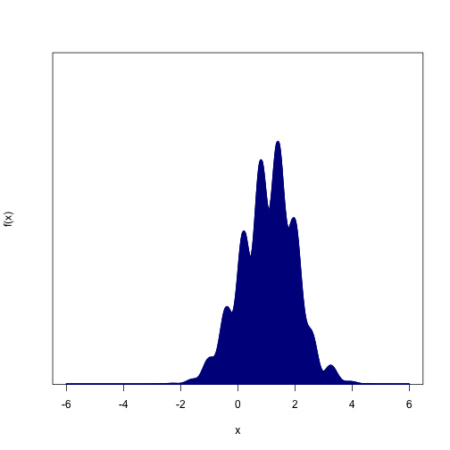
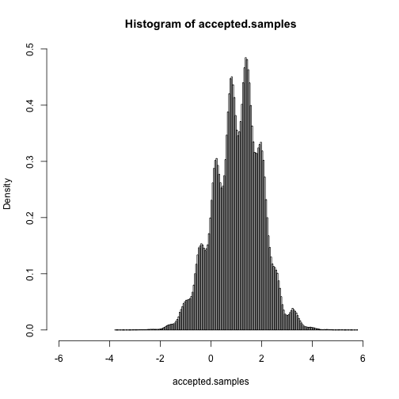
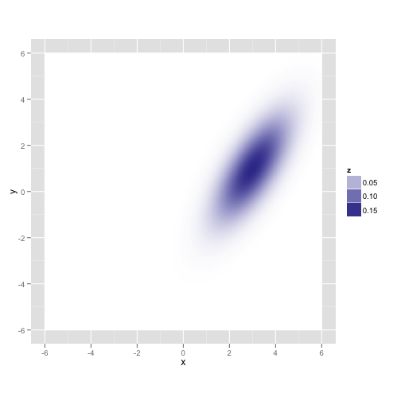
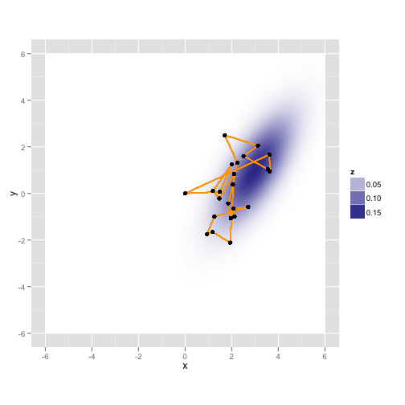
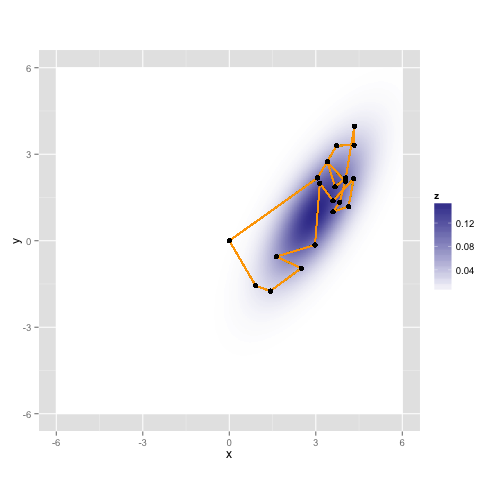
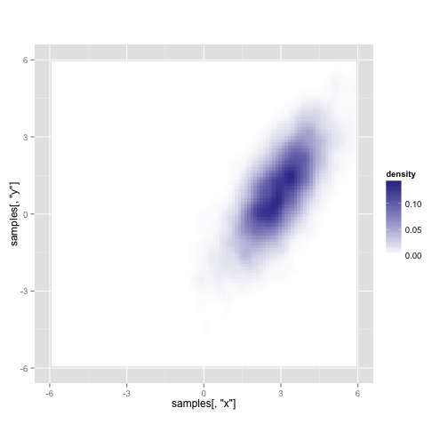

# Monte Carlo methods in statistics and Markov chain Monte Carlo

Dave Harris
Davis R Users Group, 2013-3-13

## The goal: Learn about a probability distribution

Probability distributions are super-useful because they can define a range of possibilities we expect to observe if our models are true (if you're a frequentist) or the range of plausible values for our parameters (if you're a Bayesian).

Some probability distributions, like the Normal distribution and the Poisson distribution, are relatively straightforward to work with mathematically and we have lots of handy tools for working with them by hand and on the computer.

Other probability distributions--such as distributions over parameters in a complicated model--are harder to work with.  Then we need more general tools. **Monte Carlo methods work by taking samples from a distribution that's hard to study analytically, and then studying the samples instead.**


### Example:

Here's an ugly probability distribution.  Note that, in addition to being wiggly, we don't actually know how to scale the y-axis so that the distribution sums to 1.
  
 


Even if you knew the equation that generated that thing, and you remembered everything you learned in calculus and statistics, you probably couldn't find its mean or its quantiles very easily.  But if you had 10,000 samples from the distribution, you could estimate the distribution's mean instantly by taking the sample mean.  

## Simple Monte Carlo: Rejection sampling


```r
N = 1e+07
ceiling = max(f(xs) + 1)

# Step 1: Throw N darts (uniformly distributed x-y pairs) at the plot
# above.
test.xs = runif(N, min = min(xs), max = max(xs))
test.ys = runif(N, min = 0, max = ceiling)


# Step 2: Throw away any samples that hit white areas (above the curve)
accepted.samples = test.xs[test.ys < f(test.xs)]

# Step 3: Study the samples however you want
hist(accepted.samples, breaks = 150, xlim = range(xs), freq = FALSE)
```

 

```r

mean(accepted.samples)
```

```
## [1] 1.055
```

```r

quantile(accepted.samples, probs = seq(0, 1, length = 25))
```

```
##       0%   4.167%   8.333%    12.5%   16.67%   20.83%      25%   29.17% 
## -3.76101 -0.63020 -0.32693 -0.05038  0.12511  0.26349  0.41607  0.57226 
##   33.33%    37.5%   41.67%   45.83%      50%   54.17%   58.33%    62.5% 
##  0.69066  0.78801  0.88096  0.98307  1.10093  1.21447  1.31154  1.39900 
##   66.67%   70.83%      75%   79.17%   83.33%    87.5%   91.67%   95.83% 
##  1.48678  1.58418  1.70213  1.83408  1.96193  2.09328  2.27571  2.61357 
##     100% 
##  5.78968
```


Intuitively, it should be clear that this works: wherever the curve is tallest, there's a higher probability that the darts will be retained.

That worked pretty well, but it was kind of inefficient--we ended up throwing away more than 90% of our sampling effort because the darts sailed right over the probability distribution.

Of course, this is a toy example.  It turns out that you may end up throwing away exponentially more attempts per successful sample as the number of dimensions in your data goes up.  So hardly anyone uses rejection sampling anymore--that's where the Markov chains come in.

## Markov chain Monte Carlo

Most of our discarded samples came from the tails of the distribution, where the acceptance probability is basically zero.  We could increase the number of samples we keep by spending more time in the middle of the distribution, where the acceptance probabilities are much higher.

But if all we did was concentrate our dart-throwing efforts there, then we'd end up with heavily biased samples--we don't find *any* probability mass in areas where we don't look.  Also, even if we could correct for that, we won't always know where to concentrate our efforts.  So we'll usually need something more automatic.

That's where the Markov chains come in.  MCMC has exactly the same goal as our rejection sampler, but it has more sophisticated ways of deciding where to sample.  That way, we can get a decent number of samples in a reasonable amount of time.  The downside is that the samples are correlated, so you might need a lot more of them before you've explored the whole distribution.  And you usually won't know when it's "done"--the theorems usually just say it'll work if you run the process for an infinitely long time.

Let's see what happens if we try this out on a simpler distribution in 2D.


```r
library(MASS)
library(ggplot2)
lik = function(x, y) {
    dnorm(x - 3) * dnorm(y - x + 2)
}

grid = expand.grid(x = xs, y = xs)
z = lik(grid$x, grid$y)

gaussian.plot = ggplot(data = grid, aes(x = x, y = y)) + geom_raster(aes(fill = z)) + 
    scale_fill_gradient2() + coord_equal()

gaussian.plot
```

 


Let's take a random walk along X and Y, collecting samples in proportion to their probability.  This is just like the rejection sampler, but we'll tend to throw our darts in the neighborhood of our last accepted proposal, and the acceptance rule is a bit more complicated.

Here's a sampler called the "Metropolis" algorithm, although Wikipedia claims Metropolis wasn't really involved.


```r
maxit = 50

samples = matrix(NA, nrow = maxit, ncol = 2, dimnames = list(NULL, c("x", "y")))
samples[1, ] = c(0, 0)  # start at 0,0

for (i in 2:maxit) {
    
    # propose a new sample point
    proposal = samples[i - 1, ] + rnorm(2, mean = 0, sd = 1)
    
    # Compare its likelihood with the current position
    old.lik = lik(samples[i - 1, "x"], samples[i - 1, "y"])
    new.lik = lik(proposal["x"], proposal["y"])
    
    ratio = new.lik/old.lik
    
    # flip a coin and accept the new proposal with probability min(ratio, 1)
    if (rbinom(1, size = 1, prob = min(ratio, 1))) {
        samples[i, ] = proposal
    } else {
        samples[i, ] = samples[i - 1, ]
    }
    
}


gaussian.plot + geom_path(mapping = aes(x = samples[, "x"], y = samples[, "y"]), 
    color = "orange") + geom_point(mapping = aes(x = samples[, "x"], y = samples[, 
    "y"]))
```

 


Here it is again with a different random walk using the same process

 


Here's what you get after running it for 10,000 iterations (about a second on my laptop)


```
## Warning: Removed 20 rows containing non-finite values (stat_density2d).
```

 


## Practical issues:

Here's a somewhat opinionated take on things to look out for when you're doing MCMC.

* **Initial values:** The chain has to start somewhere, and your initial samples will tend to cluster near that starting value.  That's not very random! Opinions differ about how to deal with this issue.  If you run the chain long enough, it doesn't really matter, since the first few samples will get swamped.  If you start the chain near a mode of the distribution or with a sample from a previous MCMC run, it might not introduce much bias, since the chain was probably going to be spending a bunch of time there anyway.  If it still bothers you, there's nothing wrong with throwing away some of the early samples (which is called "discarding the burn-in period").

* **Choosing a proposal distribution:** A lot of the work that's been done on MCMC over the past 50 years involves finding better proposal distributions.

  * My recollection is that you want to tune your Metropolis sampler so that it accepts about 2/3 of the time.  Much more than that and you're not trying enough new things, so your samples are too correlated; much less than that and you're wasting your CPU.

  * If you can decompose your probability distribution into *conditional probabilities*, then the best approach is often an alternative to Metropolis sampling called **Gibbs sampling**. This is what a lot of the automatic MCMC tools like BUGS and JAGS use.  Gibbs sampling doesn't need any fine-tuning and is always able to accept its proposals, but it can't move in more than one dimension at a time if the dimensions are correlated. Gibbs samplers are also very straightforward and can be written in just a few lines of code.
  
  * An even better approach in many high-dimensional cases is called **Hamiltonian Monte Carlo** or (**Hybrid Monte Carlo**).  It makes proposals based on physics model with sample particles rolling along the distribution like a big mountain range.  The physics simulations can be computationally expensive, but the resulting samples are much more independent.  It's also much less sensitive to correlations among your variables that could mess up Metropolis and Gibbs sampling, since the physics doesn't care about that as much. Once you have a proposal, the decision to accept it looks like the Metropolis rule.
  
  * One of the hardest things for MCMC to deal with is multi-modal distributions, since the Markov chain might not find its way between two hills if there's a big valley in between.  Often, you won't even know there's a second mode, and that your sampler only found a tiny part of the space. One thing that can help enormously is temporarily "melting down" the distribution, so it's flatter and easier to explore (e.g. by adding thermal noise to your sampler).  You don't actually keep any samlpes from the "melted" distribution, since it's not the distribution you're actually interested in, but this process can open up pathways that would otherwise be blocked. Depending on the details of how you do this, the decision to accept one of these proposals often looks like the Metropolis rule.
  
  * You can usually mix-and-match samplers, e.g. by taking 100 small steps with Metropolis, then taking a big, computationally expensive step with something else, then taking another 100 small steps with Metropolis, etc.
  
* **Knowing when to stop:** There are convergence diagnostics and measures of your effective sample size, but no one is really sure how good they are.  To be safe, it's often best to run the chains much longer than you think you need to, and to do many runs from different starting points. The theorems about this stuff mainly just talk about what will happen if you run the chain for an infinitely long time.
